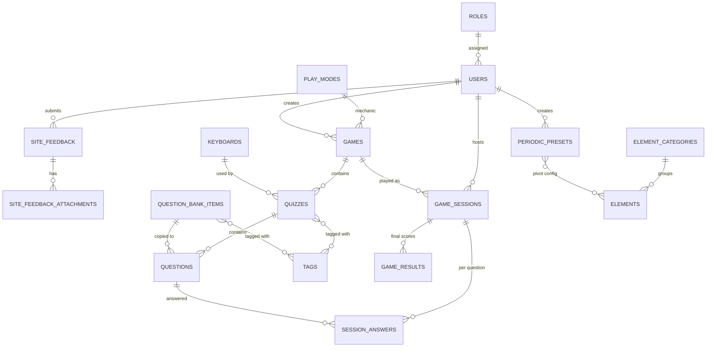

# Data Model — Hóa Thầy Đạt

> Schema chốt trước Phase 1.1. Migrations Laravel implement theo file này.
> Chi tiết loại câu hỏi/đáp án: [`APP_LOGIC.md`](APP_LOGIC.md) §3.1.

**Cập nhật lần cuối:** 2026-07-22 (Mẫu thẻ: `frameCropY` trên layout mỗi mặt)

---

## 1. ERD



---

## 2. Quy ước chung

| Quy tắc | Giá trị |
|---|---|
| `users` | Mở rộng bảng Laravel mặc định — **không** tạo bảng mới |
| Login giáo viên | Email + password (Laravel Auth) |
| Nội dung câu hỏi | **1 cột** `content` (LONGTEXT HTML) — text + ảnh + video qua rich text editor |
| HTML sanitize | Bắt buộc server-side trước khi lưu (HTMLPurifier hoặc tương đương) |
| Xóa `games` có quiz | **RESTRICT** — chặn xóa, bắt xóa/chuyển quiz trước |
| Xóa `keyboards` đang dùng | **RESTRICT** |
| 1 `game_session` (MVP) | Chơi **1 quiz** đã chọn (`quiz_id`); `game_id` giữ để nhóm/báo cáo. Session cũ không có `quiz_id` → ws chơi toàn bộ quiz trong game |

---

## 3. Bảng `roles`

| Cột | Kiểu | Ghi chú |
|---|---|---|
| `id` | BIGINT PK | |
| `name` | VARCHAR(64) | VD: "Giáo viên" |
| `slug` | VARCHAR(32) UNIQUE | `admin`, `teacher` — dùng cho phân quyền sau |
| `description` | VARCHAR(255) NULL | |
| `created_at`, `updated_at` | TIMESTAMP | |

Seed mặc định: `admin` (Quản trị viên), `teacher` (Giáo viên). **Học sinh không có account** — chưa có role `student`.

---

## 4. Bảng `users` (Laravel + mở rộng)

Bảng đã có từ Laravel default migration. **Thêm cột:**

| Cột | Kiểu | Ghi chú |
|---|---|---|
| `role_id` | BIGINT FK → `roles.id` RESTRICT | Thay `ENUM role` cũ |
| `avatar_path` | VARCHAR(255) NULL | Ảnh đại diện (`storage/app/public/avatars/`). Null → UI hiển thị initials |

Giữ nguyên: `id`, `name`, `email` UNIQUE, `password`, `remember_token`, `email_verified_at`, `timestamps`.

Accessor model: `avatar_url` (public URL), `initials` (2 chữ cái đầu từ `name`).

---

## 5. Bảng `site_feedback`

Góp ý nội bộ từ GV/admin qua widget floating trên mọi trang admin.

| Cột | Kiểu | Ghi chú |
|---|---|---|
| `id` | BIGINT PK | |
| `user_id` | BIGINT FK → `users.id` CASCADE | Người gửi |
| `page_url` | VARCHAR(512) | URL path lúc submit (client gửi, server validate bắt đầu `/admin`) |
| `page_title` | VARCHAR(255) NULL | `document.title` lúc submit |
| `body` | TEXT | Nội dung góp ý |
| `priority` | ENUM `low`,`medium`,`high` | Mặc định `medium` |
| `status` | ENUM `new`,`read`,`done` | Mặc định `new`; admin đổi trạng thái |
| `created_at`, `updated_at` | TIMESTAMP | |

**Phân quyền list:** admin xem tất cả; teacher chỉ xem góp ý của mình.

---

## 6. Bảng `site_feedback_attachments`

| Cột | Kiểu | Ghi chú |
|---|---|---|
| `id` | BIGINT PK | |
| `site_feedback_id` | BIGINT FK → `site_feedback.id` CASCADE | |
| `path` | VARCHAR(255) | `storage/app/public/feedback/` |
| `mime_type` | VARCHAR(64) | |
| `size_bytes` | INT UNSIGNED | |
| `created_at`, `updated_at` | TIMESTAMP | |

Tối đa **3 ảnh** / góp ý; mỗi file ≤ 5MB; MIME `jpeg,png,gif,webp`.

---

## 7. Bảng `keyboards`

| Cột | Kiểu | Ghi chú |
|---|---|---|
| `id` | BIGINT PK | |
| `name` | VARCHAR(255) | VD: "Bàn phím hóa vô cơ" |
| `subject` | VARCHAR(64) NULL | VD: "chemistry" — chuẩn bị v2.0 đa môn |
| `config` | JSON | Layout bàn phím — cấu trúc `rows[]` + `defaults` + `smart_context` — xem [`KEYBOARD_SCHEMA.md`](KEYBOARD_SCHEMA.md). `smart_context` quy định hành vi nhập số (hệ số vs chỉ số dưới) khi HS gõ và trong **Test** overlay của editor |
| `preview_path` | VARCHAR(255) NULL | Đường dẫn tương đối file PNG preview (disk `public`) — VD: `keyboards/06-07-2026-ban-phim-hoa-vo-co.png` |
| `created_at`, `updated_at` | TIMESTAMP | |

**Preview ảnh:** Admin editor chụp DOM `#kbePhoneKb` (`html2canvas`) khi **Save** hoặc lần đầu mở editor (nếu chưa có ảnh) → `POST /api/keyboards/{id}/preview` → lưu `storage/app/public/keyboards/{dd-mm-YYYY}-{slug-ten-ban-phim}.png` (trùng tên trong ngày → thêm `-{id}`). Client: bake computed styles (RGB) vào clone off-DOM, `onclone` **remove stylesheet** (html2canvas không parse `oklch`/`oklab` từ CSS trang/browser), tạm tắt `transform`/`overflow:hidden`/`filter` trên device frame. Truy cập qua `/storage/...` (cần `php artisan storage:link`). Model expose `preview_url` (accessor, không lưu DB). Xóa bàn phím → xóa file preview tương ứng.

### Lưu từ Keyboard Editor

| Editor (`keyboard-editor.js`) | DB |
|---|---|
| `data.name` | `keyboards.name` |
| `(chưa có UI)` | `keyboards.subject` — mặc định `chemistry` |
| `{ defaults, rows, smart_context }` | `keyboards.config` |
| Chụp `#kbePhoneKb` (html2canvas) | `keyboards.preview_path` — PNG qua API upload |
| `data.id`, `data.updatedAt` | **Không lưu** — dùng `keyboards.id`, `updated_at` |

**Test overlay (editor):** nút **Test** mô phỏng nhập công thức HS — dùng `config.smart_context` để tự phân loại phím số (`0`–`9`): hệ số (số to) ở đầu công thức / sau `+`; chỉ số dưới (hiển thị `<sub>`) sau nguyên tố / sau `)`. Backspace xóa theo **token** (vd. `Cl` = 1 token). Plain text serialize (vd. `2CO2`) lưu tạm `data-serialized` trên `#kbeTestOutput` — **không** ghi DB; format này khớp `answer` formula gửi WS (xem [`API_CONTRACTS.md`](API_CONTRACTS.md) §9.1).

Prototype hiện lưu localStorage key `htd_chemical_keyboard` (full object). Production: tách `name` → cột, phần còn lại → `config` JSON.

---

## 4.1 Bảng `play_modes`

Đăng ký kiểu chơi (~10 mode dự kiến). Mỗi row = một engine WS + UI host/HS.

| Cột | Kiểu | Ghi chú |
|---|---|---|
| `id` | BIGINT PK | |
| `slug` | VARCHAR(64) UNIQUE | VD: `kahoot_sync`, `duck_race` |
| `name` | VARCHAR(255) | Tên hiển thị admin |
| `description` | TEXT NULL | |
| `student_ui` | VARCHAR(64) | VD: `quiz-sync`, `duck-race` |
| `host_ui` | VARCHAR(64) | VD: `host-quiz`, `host-duck-race` |
| `banner_path` | VARCHAR(255) NULL | Ảnh preview trong `storage/app/public/` |
| `default_config` | JSON NULL | Luật mặc định của mode |
| `is_active` | BOOLEAN DEFAULT true | |
| `created_at`, `updated_at` | TIMESTAMP | |

Seed: `kahoot_sync`, `duck_race`.

### 4.1.1 `default_config` theo mode

**`kahoot_sync`** (mặc định):

```json
{
  "scoring": { "type": "kahoot_time" },
  "flow": { "sync_questions": true, "use_timer": true }
}
```

**`duck_race`** (migration `2026_07_09_200000_create_play_modes_and_duck_race`):

```json
{
  "scoring": {
    "correct_delta": 3,
    "wrong_delta": -5,
    "allow_negative": true
  },
  "win": {
    "target_score": 30,
    "podium_size": 3
  },
  "flow": {
    "sync_questions": false,
    "advance_on": "submit",
    "use_timer": false,
    "end_when_podium_full": true
  },
  "visual": {
    "theme": "duck_race",
    "track_steps": 30,
    "track_bounds": { "start_pct": 20, "end_pct": 90 },
    "lane_bounds": { "top_pct": 50, "bottom_pct": 92 },
    "duck_sprite_px": 64,
    "duck_swim_ms": 1150,
    "duck_sprites": ["ducks/duck-blue.gif"],
    "assets": {
      "banner": "/app/assets/duck-race/banner.png",
      "background": "/app/assets/duck-race/background.png",
      "duck": "/app/assets/duck-race/duck-blue.gif"
    }
  }
}
```

| Khóa | Ghi chú |
|---|---|
| `scoring.correct_delta` / `wrong_delta` | Điểm cộng/trừ mỗi câu (submit ngay) |
| `scoring.allow_negative` | Cho phép tổng điểm âm (vịt dừng vạch xuất phát) |
| `win.target_score` | Mốc về đích; đồng bộ với `track_steps` mặc định |
| `win.podium_size` | Số HS về đích tối đa trước khi tự kết thúc (thực tế = `min(podium_size, số HS trong phòng)`) |
| `flow.end_when_podium_full` | `true` → đủ người về đích theo quy tắc trên thì `game_ended` |
| `visual.track_steps` | Số bước tối đa trên đường đua (thường = `target_score`) |
| `visual.track_bounds` | Mép đường đua trên ảnh nền (% chiều rộng ảnh): `start_pct` (xuất phát), `end_pct` (đích). Mặc định `20`→`90`. **Host:** map `position` 0–100 → `left` % trong khoảng này; mọi vịt cùng X khi `position=0` |
| `visual.lane_bounds` | Chiều cao vùng đứng vịt (% chiều cao ảnh nền): `top_pct`, `bottom_pct`. Mặc định `50`→`92`. Admin chỉnh bằng 2 vạch ngang. **Host:** tạo pond `#duckRaceLanes` khớp khung ảnh; mỗi HS có `bottom` % **cố định** (gán lần đầu trong client, spread trong pond), không đổi khi điểm thay đổi |
| `visual.duck_sprites` | Danh sách sprite tương đối trong `duck-race/` (quét từ `ducks/` khi lưu game). WS xáo trộn gán `player.duck_sprite` |
| `visual.duck_sprite_px` | Kích thước cạnh sprite vịt trên host (px, `32`–`128`, mặc định `64`). Admin chỉnh bằng canvas + preview. CSS var `--duck-sprite-px` |
| `visual.duck_swim_ms` | Thời gian bơi mỗi bước (ms, `400`–`3000`, mặc định `1150`). Host chỉ animate `left` (trục X); Y không transition |
| `visual.assets` | Đường dẫn asset host/HS (public) |
| `visual` (host UI) | **Client-only** — `php-admin/public/htd-admin/js/duck-race-host.js` + `duck-race-host.css`. Trục **X** từ `position` + `track_bounds`; trục **Y** cố định/HS trong `lane_bounds`. Không lệch ngang khi trùng tiến độ |

`games.mode_config` và `game_sessions.mode_config` **override** từng nhánh của `default_config` (merge shallow ở WS). Luồng chi tiết: [`APP_LOGIC.md`](APP_LOGIC.md) §3.2.

---

## 5. Bảng `games`

| Cột | Kiểu | Ghi chú |
|---|---|---|
| `id` | BIGINT PK | |
| `name` | VARCHAR(255) | |
| `description` | TEXT NULL | |
| `play_mode_id` | BIGINT FK → `play_modes.id` NULL | Kiểu chơi; game cũ backfill `kahoot_sync` |
| `mode_config` | JSON NULL | Override `default_config` (VD đua vịt: +3/-5, mốc 30, `track_bounds`). Admin form có editor kéo vạch xuất phát/đích trên ảnh nền |
| `created_by` | BIGINT FK → `users.id` NULL | GV tạo game |
| `created_at`, `updated_at` | TIMESTAMP | |

---

## 6. Bảng `quizzes`

| Cột | Kiểu | Ghi chú |
|---|---|---|
| `id` | BIGINT PK | |
| `game_id` | BIGINT FK → `games.id` ON DELETE RESTRICT | |
| `keyboard_id` | BIGINT FK → `keyboards.id` ON DELETE RESTRICT | |
| `name` | VARCHAR(255) | |
| `subject` | VARCHAR(64) NULL | |
| `grade` | VARCHAR(32) NULL | VD: "10", "11" |
| `sort_order` | SMALLINT NOT NULL DEFAULT 0 | Thứ tự trong game khi chơi |
| `is_active` | BOOLEAN NOT NULL DEFAULT true | Ẩn quiz không dùng |
| `show_explanation` | BOOLEAN NOT NULL DEFAULT false | Bật → gửi `explanation` trong `question_result` sau khi HS trả lời |
| `shuffle_options` | BOOLEAN NOT NULL DEFAULT false | Bật → xáo trộn thứ tự `options` trắc nghiệm riêng từng HS |
| `created_at`, `updated_at` | TIMESTAMP | |

**Chủ đề (tag):** quan hệ N–N qua `quiz_tag` — xem §6.1.

### 6.1 Bảng `tags` & `quiz_tag`

| Bảng | Cột | Ghi chú |
|---|---|---|
| `tags` | `id`, `name` UNIQUE, `slug` UNIQUE, `color` CHAR(7) DEFAULT `#2D46D6`, `timestamps` | Chủ đề có màu — 7 preset + custom qua admin UI |
| `quiz_tag` | `quiz_id` FK, `tag_id` FK | PK composite — 1 quiz nhiều tag |

Admin nhập tag dạng chuỗi phân cách dấu phẩy; lọc quiz theo tag trên `/admin/quizzes`.

---

## 7. Bảng `questions`

Nội dung câu hỏi gộp trong `content`. Loại tương tác học sinh qua `answer_type`.

| Cột | Kiểu | Ghi chú |
|---|---|---|
| `id` | BIGINT PK | |
| `quiz_id` | BIGINT FK → `quizzes.id` ON DELETE CASCADE | |
| `source_bank_question_id` | BIGINT FK → `question_bank_items.id` ON DELETE SET NULL NULL | Nguồn từ bộ câu hỏi (nếu copy); NULL nếu tạo trực tiếp trong quiz |
| `content` | LONGTEXT NOT NULL | HTML: đề text + `` + `<video>` (sanitize trước lưu) |
| `explanation` | LONGTEXT NULL | HTML giải thích đáp án (tuỳ chọn, sanitize trước lưu) |
| `answer_type` | ENUM('mc','essay','structured') NOT NULL | |
| `options` | JSON NULL | `mc`: `["đáp án A", "B", "C", "D"]` — tối thiểu 2, tối đa 6 |
| `correct_index` | TINYINT UNSIGNED NULL | `mc`: index 0-based |
| `correct_answer_normalized` | TEXT NULL | `essay`: đáp án mẫu (so khớp văn bản) |
| `input_mode` | VARCHAR(32) NULL | `structured`: `balance` \| `blank` \| `blank_balance` \| `product` |
| `template` | JSON NULL | `structured`: mảng parts — xem [`QUESTION_TEMPLATE_SCHEMA.md`](QUESTION_TEMPLATE_SCHEMA.md) |
| `correct_answer` | JSON NULL | `structured`: `{ coef: {c0:"2"}, blank: {b0:"O2"} }` |
| `time_limit_seconds` | INT NOT NULL DEFAULT 30 | |
| `points` | SMALLINT UNSIGNED NOT NULL DEFAULT 1 | Điểm cơ bản khi trả lời đúng (1–100) |
| `sort_order` | SMALLINT NOT NULL DEFAULT 0 | Thứ tự trong quiz |
| `is_active` | BOOLEAN NOT NULL DEFAULT true | Ẩn câu hỏi khi tắt (không đưa vào phòng chơi) |
| `created_at`, `updated_at` | TIMESTAMP | |

### Validation theo `answer_type`

| `answer_type` | Field bắt buộc |
|---|---|
| `mc` | `options` (≥2), `correct_index` |
| `essay` | `correct_answer_normalized` (đáp án mẫu) |
| `structured` | `input_mode`, `template` (≥1 ô coef/blank), `correct_answer` khớp mọi id |

### Ví dụ `content` (HTML)

```html
<p>Quan sát ống nghiệm như hình. Dung dịch có màu gì?</p>

```

```html
<p>Quan sát video thí nghiệm:</p>
<video src="/storage/questions/demo.mp4" poster="/storage/questions/demo-poster.jpg" controls></video>
```

---

## 7.1 Bảng `question_bank_items` (bộ câu hỏi)

Câu hỏi mẫu tái sử dụng — **không** gắn `quiz_id`. Khi thêm vào quiz → **copy** sang `questions` (bản sao độc lập).

| Cột | Kiểu | Ghi chú |
|---|---|---|
| `id` | BIGINT PK | |
| `content` | LONGTEXT NOT NULL | Giống `questions.content` |
| `explanation` | LONGTEXT NULL | |
| `answer_type` | ENUM('mc','essay','structured') NOT NULL | |
| `options` | JSON NULL | `mc` |
| `correct_index` | TINYINT UNSIGNED NULL | `mc` |
| `correct_answer_normalized` | TEXT NULL | `essay` |
| `input_mode` | VARCHAR(32) NULL | `structured` |
| `template` | JSON NULL | `structured` |
| `correct_answer` | JSON NULL | `structured` |
| `time_limit_seconds` | INT NOT NULL DEFAULT 30 | Mặc định khi copy |
| `points` | SMALLINT UNSIGNED NOT NULL DEFAULT 1 | Mặc định khi copy |
| `is_active` | BOOLEAN NOT NULL DEFAULT true | |
| `created_at`, `updated_at` | TIMESTAMP | |

**Tag câu hỏi:** N–N qua `question_bank_tag` (dùng chung bảng `tags`).

| Bảng | Cột | Ghi chú |
|---|---|---|
| `question_bank_tag` | `question_bank_item_id` FK, `tag_id` FK | PK composite |

Admin: `/admin/question-bank` — CRUD + **lọc nhiều chủ đề** (checkbox, chế độ **VÀ/HOẶC** qua `tag_match`) + checkbox bulk đổi tag. Cột chủ đề chip + ⋮ editor. Modal thêm từ bộ trong quiz cũng lọc multi-tag.

**Đồng bộ với quiz:** Mọi câu tạo/sửa trong quiz tự có bản tương ứng trong bộ (`source_bank_question_id`). Câu quiz cũ được backfill khi migrate. Câu chưa gán tag → lọc **Chưa có chủ đề**.

---

## 8. Bảng `game_sessions`

| Cột | Kiểu | Ghi chú |
|---|---|---|
| `id` | BIGINT PK | |
| `pin` | CHAR(6) NOT NULL UNIQUE | 6 chữ số |
| `qr_path` | VARCHAR(255) NULL | Ảnh QR join — PNG `sessions/{pin}.png`. Join URL trong QR = `{APP_URL}/join/{pin}` (sidecar `sessions/{pin}.joinurl` để regenerate khi `APP_URL` đổi). Tạo khi **Tạo phòng**; backfill / refresh khi mở trang host. Model expose `qr_url` (accessor, `?v=` mtime) |
| `name` | VARCHAR(255) NULL | Tên phòng do GV đặt (hiển thị danh sách) |
| `host_id` | BIGINT FK → `users.id` | GV host |
| `game_id` | BIGINT FK → `games.id` | Game chứa quiz (denormalized) |
| `quiz_id` | BIGINT FK → `quizzes.id` NULL | Quiz được chơi trong phòng; NULL = legacy (chơi cả game) |
| `play_mode_slug` | VARCHAR(64) NULL | Snapshot từ `games.play_mode` lúc tạo phòng |
| `mode_config` | JSON NULL | Snapshot config lúc tạo phòng |
| `status` | ENUM('waiting','playing','ended') NOT NULL DEFAULT 'waiting' | |
| `is_active` | BOOLEAN NOT NULL DEFAULT true | Tắt → xóa Redis room, HS không join được |
| `started_at` | TIMESTAMP NULL | Khi GV bấm Start |
| `ended_at` | TIMESTAMP NULL | Khi game kết thúc |
| `created_at`, `updated_at` | TIMESTAMP | |

**Sửa phòng (admin):** đổi `name` mọi lúc; đổi `quiz_id`/`game_id` chỉ khi `status=waiting` (+ đồng bộ Redis nếu `is_active`). PIN + `qr_path` không đổi.

**Chơi lại:** Admin `POST .../reset` hoặc API `POST /api/game-sessions/{id}/reset` — đặt lại `status=waiting`, xóa state Redis (players, leaderboard, plan…), **giữ** bản ghi `game_results` / `session_answers` của lần chơi trước.

**Xóa phòng:** Admin `DELETE /admin/sessions/{id}` hoặc `POST /admin/sessions/bulk-destroy` `{ ids[] }` — purge Redis PIN, xóa file QR, xóa bản ghi session; `game_results` / `session_answers` CASCADE. **Không** xóa khi `status=playing`.

---

## 9. Bảng `game_results`

Tổng kết cuối session (1 dòng / học sinh / session).

| Cột | Kiểu | Ghi chú |
|---|---|---|
| `id` | BIGINT PK | |
| `session_id` | BIGINT FK → `game_sessions.id` ON DELETE CASCADE | |
| `student_name` | VARCHAR(20) NOT NULL | Không login — nickname |
| `player_token` | CHAR(36) NULL | UUID reconnect (Phase 2) |
| `score` | INT NOT NULL DEFAULT 0 | Tổng điểm |
| `rank` | INT NOT NULL | Hạng cuối |
| `finish_rank` | TINYINT UNSIGNED NULL | Đua vịt: thứ tự về đích (1–3); NULL nếu chưa về / mode khác |
| `finished_at` | TIMESTAMP NULL | Thời điểm chạm mốc về đích |
| `created_at`, `updated_at` | TIMESTAMP | |

---

## 10. Bảng `session_answers`

Chi tiết từng câu — phục vụ scoring, CSV, thống kê sai (v1.2).

| Cột | Kiểu | Ghi chú |
|---|---|---|
| `id` | BIGINT PK | |
| `session_id` | BIGINT FK → `game_sessions.id` ON DELETE CASCADE | |
| `question_id` | BIGINT FK → `questions.id` | |
| `student_name` | VARCHAR(20) NOT NULL | |
| `answer_submitted` | JSON NULL | Đáp án HS gửi (index / string / structured). Câu `formula`: chuỗi plain text đã serialize từ token bàn phím (vd. `"2CO2"`, không Unicode subscript) |
| `is_correct` | BOOLEAN NOT NULL | |
| `score_earned` | INT NOT NULL DEFAULT 0 | Điểm câu này |
| `answered_at` | TIMESTAMP NOT NULL | |

**Unique:** `(session_id, question_id, student_name)` — chống double-submit ở DB.

---

## 11. Bảng `students` (bổ sung)

| Cột | Kiểu | Ghi chú |
|---|---|---|
| `email` | VARCHAR(190) NULL | Email học sinh (tùy chọn). Dùng bind trên mẫu thẻ in phiếu tài khoản |

---

## 12. Bảng `card_templates`

Mẫu thẻ tài khoản tùy chỉnh do giáo viên thiết kế (WYSIWYG). Thuộc về giáo viên, tái sử dụng cho nhiều lớp.

| Cột | Kiểu | Ghi chú |
|---|---|---|
| `id` | BIGINT PK | |
| `teacher_id` | BIGINT FK → `users.id` ON DELETE CASCADE | Chủ sở hữu |
| `name` | VARCHAR(120) | Tên template |
| `sides` | TINYINT | `1` = một mặt, `2` = hai mặt |
| `frame_width_mm` | DECIMAL(6,2) | Khung thẻ (dùng chung cả 2 mặt) |
| `frame_height_mm` | DECIMAL(6,2) | Khung thẻ (dùng chung cả 2 mặt) |
| `front_baked_path` | VARCHAR(255) NULL | PNG đã bake 300 DPI mặt trước (`storage/app/public/`) |
| `back_baked_path` | VARCHAR(255) NULL | PNG đã bake 300 DPI mặt sau |
| `layout` | JSON | Cấu trúc editor — xem `docs/card-template-designer-plan.md` |
| `created_at`, `updated_at` | TIMESTAMP | |
| `deleted_at` | TIMESTAMP NULL | Soft delete |

**Quan hệ:** `users` 1—N `card_templates`.

**Cấu trúc `layout` JSON (tóm tắt):**
- `front` / `back`: `{ imageLayers[], elements[], frameCropY }` — geometry element theo phân số [0..1] **trong khung thẻ**; `frameCropY` [0..1] = vị trí dọc khung crop trên ảnh nền full-width
- `a4`: `{ marginMm, gapMm, cardWidthMm }` — cấu hình xếp lưới A4

Ảnh gốc từng lớp: `card-templates/{id}/{side}/{layerId}.png` trên disk `public`.

---

## 13. Module «Đọc nguyên tố» (bảng tuần hoàn)

Catalog gốc dùng chung mọi phiên bản; cấu hình hiện/ẩn/Pro nằm ở pivot theo từng phiên bản. Học sinh **chỉ** đọc `published_snapshot` của phiên bản `is_live`.

Migrations: `2026_07_22_000001` … `000004`. Seed: `PeriodicTableSeeder` (gọi từ `DatabaseSeeder`) — ~10 nhóm + ~45 nguyên tố chương trình + phiên bản «Mặc định» (xuất bản nếu chưa có bản live).

### 13.1 Bảng `element_categories`

| Cột | Kiểu | Ghi chú |
|---|---|---|
| `id` | BIGINT PK | |
| `slug` | VARCHAR(64) UNIQUE | Ổn định — client HS map màu theo slug (`kiem`, `halogen`…) |
| `name` | VARCHAR | Nhãn hiển thị |
| `color` | VARCHAR(32) | Màu ô |
| `deep_color` | VARCHAR(32) | Màu đậm (viền/nhấn) |
| `sort_order` | SMALLINT UNSIGNED DEFAULT 0 | |
| `created_at`, `updated_at` | TIMESTAMP | |

**Quan hệ:** 1—N `elements`. Đổi tên/màu → đánh dấu mọi `periodic_presets.has_unpublished_changes = true`. Xóa nhóm → `elements.category_id` null (`nullOnDelete`).

### 13.2 Bảng `elements`

Catalog nguyên tố gốc. Đổi tên/khối lượng/sound áp dụng mọi phiên bản (đánh dirty toàn bộ preset).

| Cột | Kiểu | Ghi chú |
|---|---|---|
| `id` | BIGINT PK | |
| `z` | SMALLINT UNSIGNED UNIQUE | Số hiệu nguyên tử |
| `symbol` | VARCHAR(8) | |
| `name_vi`, `name_en` | VARCHAR | |
| `mass` | DECIMAL(9,4) | |
| `category_id` | BIGINT FK → `element_categories.id` NULL ON DELETE SET NULL | |
| `phonetic` | VARCHAR NULL | Gợi ý đọc TV (TTS phụ) |
| `group_no` | TINYINT UNSIGNED | Cột 1–18 |
| `period_no` | TINYINT UNSIGNED | Chu kỳ 1–7 |
| `sound_path` | VARCHAR NULL | Audio upload disk `public` (`elements/{slug-z}-{YmdHis}.ext`); accessor `sound_url` |
| `sort_order` | SMALLINT UNSIGNED DEFAULT 0 | Thứ tự mặc định (seed: priority chương trình rồi `z`) |
| `created_at`, `updated_at` | TIMESTAMP | |

### 13.3 Bảng `periodic_presets`

Một «phiên bản bảng». Mô hình Nháp / Xuất bản:

| Cột | Kiểu | Ghi chú |
|---|---|---|
| `id` | BIGINT PK | |
| `name` | VARCHAR | |
| `is_live` | BOOLEAN DEFAULT false | Chỉ **một** phiên bản `true` tại một thời điểm |
| `published_snapshot` | JSON NULL | Đóng băng lúc Xuất bản — payload HS đọc |
| `published_at` | TIMESTAMP NULL | |
| `has_unpublished_changes` | BOOLEAN DEFAULT false | Badge «có thay đổi chưa xuất bản» |
| `note` | TEXT NULL | |
| `created_by` | BIGINT FK → `users.id` NULL ON DELETE SET NULL | |
| `created_at`, `updated_at` | TIMESTAMP | |

**`publish()`:** unset `is_live` các bản khác → `published_snapshot = buildSnapshot()` → `is_live=true`, `has_unpublished_changes=false`.

**`buildSnapshot()`** (chỉ phần tử `is_visible`):

```jsonc
{
  "categories": {
    "kiem": { "label": "Kim loại kiềm", "color": "#FF5DA2", "deep": "#D63384" }
    /* … key = slug … */
  },
  "elements": [
    {
      "z": 1, "symbol": "H", "nameVi": "Hiđro", "nameEn": "Hydrogen",
      "mass": 1.008, "category": "phi-kim", "phonetic": "Hi-đrô",
      "soundUrl": null, "group": 1, "period": 1,
      "order": 1, "isLit": true, "requiresPro": false
    }
  ]
}
```

`order` = `sort_override` pivot nếu có, không thì `elements.sort_order`.

### 13.4 Bảng `periodic_preset_element` (pivot NHÁP)

Cấu hình theo phiên bản — chưa tới HS cho tới khi Xuất bản.

| Cột | Kiểu | Ghi chú |
|---|---|---|
| `id` | BIGINT PK | |
| `preset_id` | BIGINT FK → `periodic_presets.id` CASCADE | |
| `element_id` | BIGINT FK → `elements.id` CASCADE | |
| `is_lit` | BOOLEAN DEFAULT true | Active/sáng; inactive vẫn hiện nhưng mờ |
| `is_visible` | BOOLEAN DEFAULT true | `false` → không đưa vào snapshot / ẩn với HS |
| `requires_pro` | BOOLEAN DEFAULT false | Ô khoá nếu HS chưa Pro feature `elements` |
| `sort_override` | SMALLINT UNSIGNED NULL | `null` = theo `elements.sort_order` |
| `created_at`, `updated_at` | TIMESTAMP | |

**Unique:** `(preset_id, element_id)`.

**Admin UI:** `/admin/periodic` (card thumbnail mode `normal` trên khung 118 ô + modal phóng to); workspace `/admin/periodic/{id}/edit` — `pw-stage` = đủ 118 ô + hàng La/Ac + chú giải nhóm nhúng (giống HS). Catalog DB (~45 nguyên tố chương trình) overlay lên layout; ô còn lại mờ «ngoài chương trình». Assets: `public/js/periodic-layout.js` (118), `periodic-grid.js`, `periodic-index.js`, `periodic-workspace.js`, `public/css/admin-periodic.css`.

---

## 14. Mở rộng tương lai (chưa implement)

| Version | Thay đổi schema |
|---|---|
| v1.2 Luyện tập | Bảng `practice_attempts` riêng |
| v2.0 LaTeX/đa môn | `answer_type` mới hoặc keyboard `subject` khác |
| v3.0 AI | `questions.source`, `questions.ai_metadata` JSON |
| Chọn subset quiz/session | Bảng `game_session_quizzes` |

---

## 15. Tài liệu liên quan

- [`docs/APP_LOGIC.md`](APP_LOGIC.md) — `answer_type`, payload WebSocket, admin `/admin/periodic`
- [`docs/API_CONTRACTS.md`](API_CONTRACTS.md) — endpoints & events (task 2.1)
- [`local-deployment-plan.md`](../local-deployment-plan.md) — checklist Phase 1
