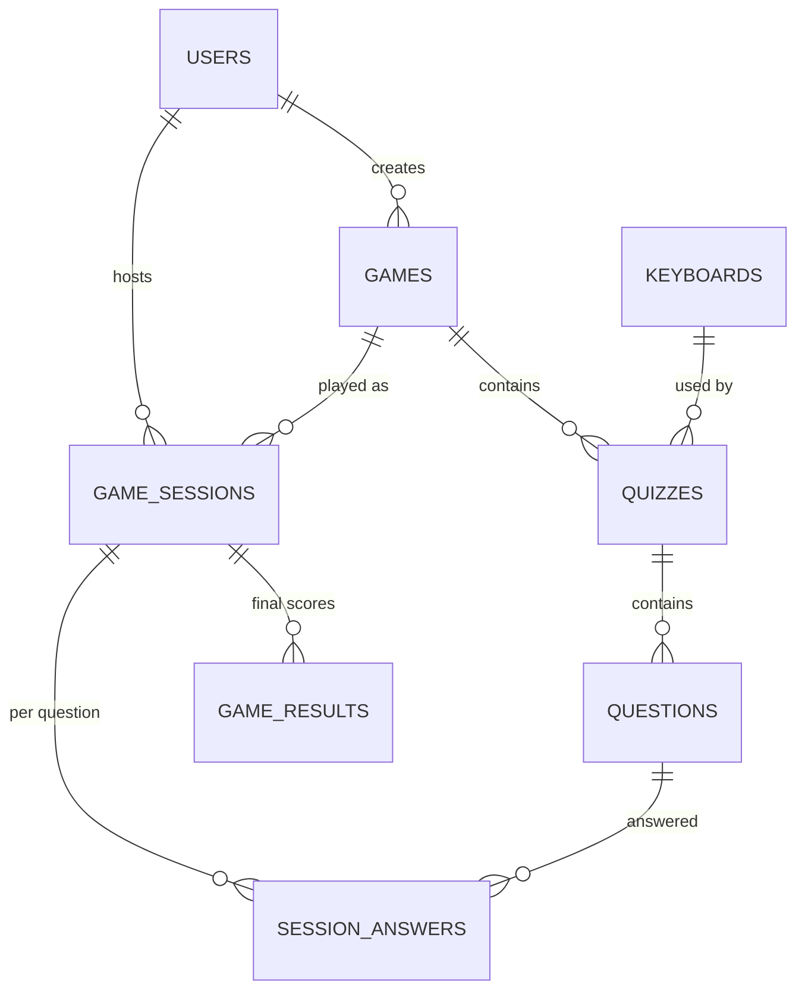

# Data Model — Hóa Thầy Đạt

> Schema chốt trước Phase 1.1. Migrations Laravel implement theo file này.
> Chi tiết loại câu hỏi/đáp án: [`APP_LOGIC.md`](APP_LOGIC.md) §3.1.

**Cập nhật lần cuối:** 2026-07-06 (migrations implemented — Laravel `2026_07_06_*`)

---

## 1. ERD



---

## 2. Quy ước chung

| Quy tắc | Giá trị |
|---|---|
| `users` | Mở rộng bảng Laravel mặc định — **không** tạo bảng mới |
| Login giáo viên | Email + password (Laravel Auth) |
| Nội dung câu hỏi | **1 cột** `content` (LONGTEXT HTML) — text + ảnh + video qua rich text editor |
| HTML sanitize | Bắt buộc server-side trước khi lưu (HTMLPurifier hoặc tương đương) |
| Xóa `games` có quiz | **RESTRICT** — chặn xóa, bắt xóa/chuyển quiz trước |
| Xóa `keyboards` đang dùng | **RESTRICT** |
| 1 `game_session` (MVP) | Chơi **tất cả** quiz trong game, theo `quizzes.sort_order` |

---

## 3. Bảng `users` (Laravel + mở rộng)

Bảng đã có từ Laravel default migration. **Chỉ thêm cột:**

| Cột | Kiểu | Ghi chú |
|---|---|---|
| `role` | `ENUM('admin','teacher') NOT NULL DEFAULT 'teacher'` | Phân quyền admin dashboard |

Giữ nguyên: `id`, `name`, `email` UNIQUE, `password`, `remember_token`, `email_verified_at`, `timestamps`.

---

## 4. Bảng `keyboards`

| Cột | Kiểu | Ghi chú |
|---|---|---|
| `id` | BIGINT PK | |
| `name` | VARCHAR(255) | VD: "Bàn phím hóa vô cơ" |
| `subject` | VARCHAR(64) NULL | VD: "chemistry" — chuẩn bị v2.0 đa môn |
| `config` | JSON | Layout bàn phím — cấu trúc `rows[]` + `defaults` + `smart_context` — xem [`KEYBOARD_SCHEMA.md`](KEYBOARD_SCHEMA.md) |
| `created_at`, `updated_at` | TIMESTAMP | |

### Lưu từ Keyboard Editor

| Editor (`keyboard-editor.js`) | DB |
|---|---|
| `data.name` | `keyboards.name` |
| `(chưa có UI)` | `keyboards.subject` — mặc định `chemistry` |
| `{ defaults, rows, smart_context }` | `keyboards.config` |
| `data.id`, `data.updatedAt` | **Không lưu** — dùng `keyboards.id`, `updated_at` |

Prototype hiện lưu localStorage key `htd_chemical_keyboard` (full object). Production: tách `name` → cột, phần còn lại → `config` JSON.

---

## 5. Bảng `games`

| Cột | Kiểu | Ghi chú |
|---|---|---|
| `id` | BIGINT PK | |
| `name` | VARCHAR(255) | |
| `description` | TEXT NULL | |
| `created_by` | BIGINT FK → `users.id` NULL | GV tạo game |
| `created_at`, `updated_at` | TIMESTAMP | |

---

## 6. Bảng `quizzes`

| Cột | Kiểu | Ghi chú |
|---|---|---|
| `id` | BIGINT PK | |
| `game_id` | BIGINT FK → `games.id` ON DELETE RESTRICT | |
| `keyboard_id` | BIGINT FK → `keyboards.id` ON DELETE RESTRICT | |
| `name` | VARCHAR(255) | |
| `subject` | VARCHAR(64) NULL | |
| `grade` | VARCHAR(32) NULL | VD: "10", "11" |
| `sort_order` | SMALLINT NOT NULL DEFAULT 0 | Thứ tự trong game khi chơi |
| `is_active` | BOOLEAN NOT NULL DEFAULT true | Ẩn quiz không dùng |
| `created_at`, `updated_at` | TIMESTAMP | |

---

## 7. Bảng `questions`

Nội dung câu hỏi gộp trong `content`. Loại tương tác học sinh qua `answer_type`.

| Cột | Kiểu | Ghi chú |
|---|---|---|
| `id` | BIGINT PK | |
| `quiz_id` | BIGINT FK → `quizzes.id` ON DELETE CASCADE | |
| `content` | LONGTEXT NOT NULL | HTML: đề text + `` + `<video>` (sanitize trước lưu) |
| `answer_type` | ENUM('mc','formula','structured') NOT NULL | |
| `options` | JSON NULL | `mc`: `["đáp án A", "B", "C", "D"]` — tối thiểu 2, tối đa 6 |
| `correct_index` | TINYINT UNSIGNED NULL | `mc`: index 0-based |
| `correct_answer_normalized` | VARCHAR(255) NULL | `formula`: chuẩn hóa H₂O → H2O |
| `input_mode` | VARCHAR(32) NULL | `structured`: `product` \| `balance` \| `blank` \| `blank_balance` |
| `template` | JSON NULL | `structured`: cấu trúc ô blank/coef (theo prototype) |
| `correct_answer` | JSON NULL | `structured`: `{blank:{b0:'O2'}, coef:{c0:'4'}}` |
| `time_limit_seconds` | INT NOT NULL DEFAULT 30 | |
| `sort_order` | SMALLINT NOT NULL DEFAULT 0 | Thứ tự trong quiz |
| `created_at`, `updated_at` | TIMESTAMP | |

### Validation theo `answer_type`

| `answer_type` | Field bắt buộc |
|---|---|
| `mc` | `options` (≥2), `correct_index` |
| `formula` | `correct_answer_normalized` |
| `structured` | `input_mode`, `template`, `correct_answer` |

### Ví dụ `content` (HTML)

```html
<p>Quan sát ống nghiệm như hình. Dung dịch có màu gì?</p>

```

```html
<p>Quan sát video thí nghiệm:</p>
<video src="/storage/questions/demo.mp4" poster="/storage/questions/demo-poster.jpg" controls></video>
```

---

## 8. Bảng `game_sessions`

| Cột | Kiểu | Ghi chú |
|---|---|---|
| `id` | BIGINT PK | |
| `pin` | CHAR(6) NOT NULL UNIQUE | 6 chữ số |
| `host_id` | BIGINT FK → `users.id` | GV host |
| `game_id` | BIGINT FK → `games.id` | Game được chơi |
| `status` | ENUM('waiting','playing','ended') NOT NULL DEFAULT 'waiting' | |
| `started_at` | TIMESTAMP NULL | Khi GV bấm Start |
| `ended_at` | TIMESTAMP NULL | Khi game kết thúc |
| `created_at`, `updated_at` | TIMESTAMP | |

---

## 9. Bảng `game_results`

Tổng kết cuối session (1 dòng / học sinh / session).

| Cột | Kiểu | Ghi chú |
|---|---|---|
| `id` | BIGINT PK | |
| `session_id` | BIGINT FK → `game_sessions.id` ON DELETE CASCADE | |
| `student_name` | VARCHAR(20) NOT NULL | Không login — nickname |
| `player_token` | CHAR(36) NULL | UUID reconnect (Phase 2) |
| `score` | INT NOT NULL DEFAULT 0 | Tổng điểm |
| `rank` | INT NOT NULL | Hạng cuối |
| `created_at`, `updated_at` | TIMESTAMP | |

---

## 10. Bảng `session_answers`

Chi tiết từng câu — phục vụ scoring, CSV, thống kê sai (v1.2).

| Cột | Kiểu | Ghi chú |
|---|---|---|
| `id` | BIGINT PK | |
| `session_id` | BIGINT FK → `game_sessions.id` ON DELETE CASCADE | |
| `question_id` | BIGINT FK → `questions.id` | |
| `student_name` | VARCHAR(20) NOT NULL | |
| `answer_submitted` | JSON NULL | Đáp án HS gửi (index / string / structured) |
| `is_correct` | BOOLEAN NOT NULL | |
| `score_earned` | INT NOT NULL DEFAULT 0 | Điểm câu này |
| `answered_at` | TIMESTAMP NOT NULL | |

**Unique:** `(session_id, question_id, student_name)` — chống double-submit ở DB.

---

## 11. Mở rộng tương lai (chưa implement)

| Version | Thay đổi schema |
|---|---|
| v1.2 Luyện tập | Bảng `practice_attempts` riêng |
| v2.0 LaTeX/đa môn | `answer_type` mới hoặc keyboard `subject` khác |
| v3.0 AI | `questions.source`, `questions.ai_metadata` JSON |
| Chọn subset quiz/session | Bảng `game_session_quizzes` |

---

## 12. Tài liệu liên quan

- [`docs/APP_LOGIC.md`](APP_LOGIC.md) — `answer_type`, payload WebSocket
- [`docs/API_CONTRACTS.md`](API_CONTRACTS.md) — endpoints & events (task 2.1)
- [`local-deployment-plan.md`](../local-deployment-plan.md) — checklist Phase 1
